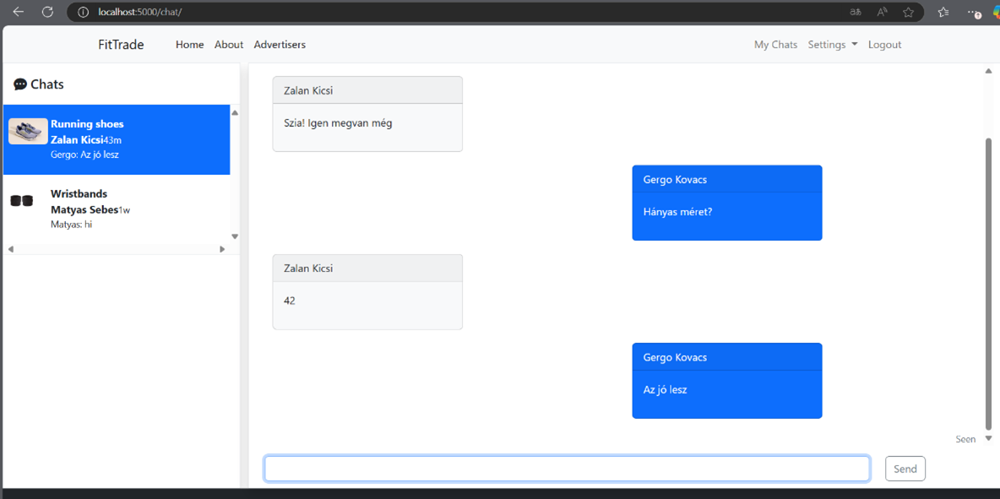
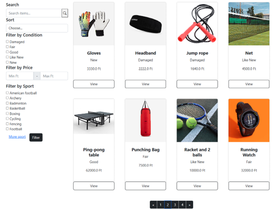
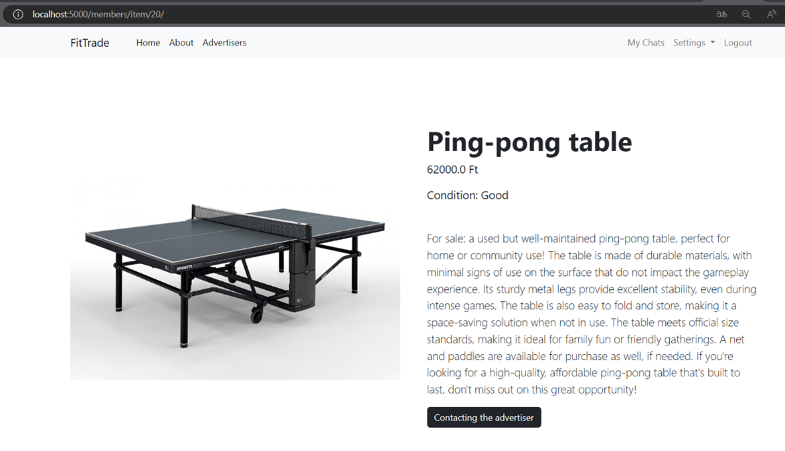
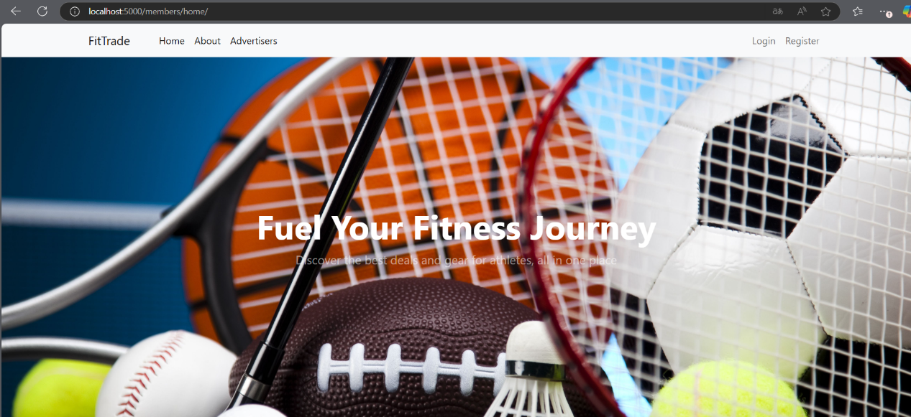

# This was my thesis on the BSc course. The description of it:

Today’s online services increasingly rely on virtual communities and interactions among users, especially on platforms where members can share, exchange, or sell items they no longer need. These types of online marketplaces have become highly popular in various aspects of daily life. 
However, many of these services are designed for a wide, general audience, which can make it challenging to provide relevant results and targeted offers for users. This issue particularly affects niche communities, such as athletes, who seek products tailored to their unique needs.
The purpose of my thesis is to create a marketplace specifically for athletes. My thesis details the development process of a web application built on Python and Django, aimed at fulfilling these specific needs.

# Technologies Used:
Python, WebSocket, Django, JSON, JavaScript, AJAX, HTML, CSS, Bootstrap, SQLIte

# Few pics about the market place:

